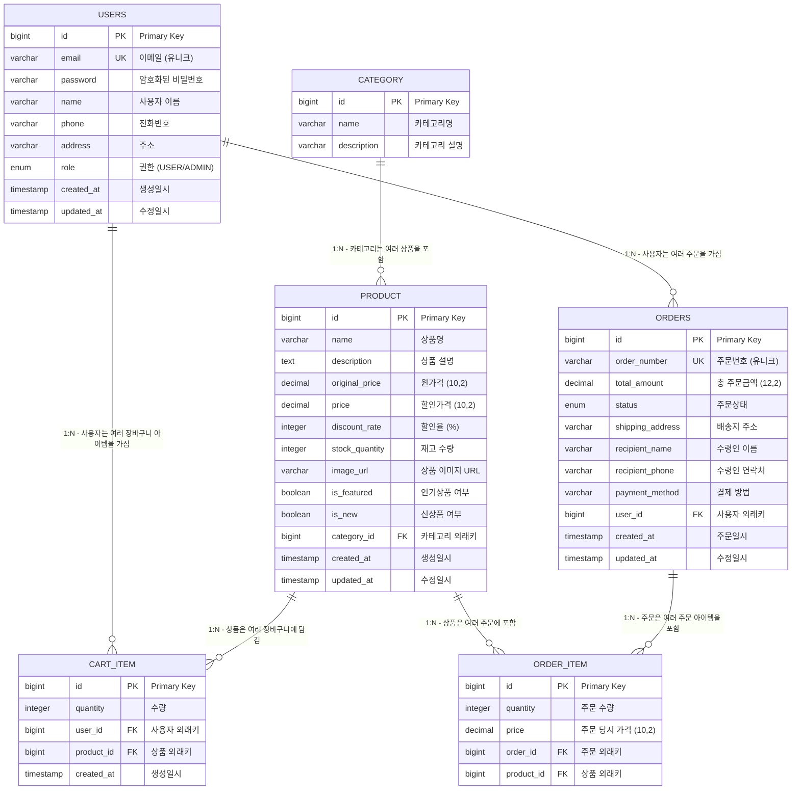

# 🗄️ 데이터베이스 설계 (ERD)

## 📋 목차

- [개요](#-개요)
- [ERD 다이어그램](#-erd-다이어그램)
- [테이블 상세 설명](#-테이블-상세-설명)
- [관계 및 제약사항](#-관계-및-제약사항)
- [인덱스 설계](#-인덱스-설계)
- [데이터 타입 및 제약사항](#-데이터-타입-및-제약사항)
- [초기 데이터](#-초기-데이터)

---

## 🎯 개요

이 문서는 E-Commerce 쇼핑몰 시스템의 데이터베이스 설계를 상세하게 설명합니다. Spring Boot와 JPA를 사용하여 구현된 6개의 핵심 테이블과 그들의 관계를 정의합니다.

### ✨ 설계 원칙
- **정규화**: 3NF (Third Normal Form) 준수
- **성능**: 적절한 인덱스 설계
- **확장성**: 향후 기능 추가를 고려한 설계
- **일관성**: 명명 규칙과 데이터 타입의 일관성

---

## 🗺️ ERD 다이어그램



---

## 📊 테이블 상세 설명

### 1. USERS 테이블
사용자 정보를 저장하는 핵심 테이블입니다.

| 컬럼명 | 데이터 타입 | 제약사항 | 설명 | 예시 |
|--------|-------------|----------|------|------|
| `id` | `BIGINT` | `PRIMARY KEY, AUTO_INCREMENT` | 사용자 고유 식별자 | 1, 2, 3... |
| `email` | `VARCHAR(255)` | `UNIQUE, NOT NULL` | 사용자 이메일 (로그인 ID) | user@example.com |
| `password` | `VARCHAR(255)` | `NOT NULL` | BCrypt로 암호화된 비밀번호 | $2a$10$... |
| `name` | `VARCHAR(100)` | `NOT NULL` | 사용자 실명 | 홍길동 |
| `phone` | `VARCHAR(20)` | `NULL` | 전화번호 | 010-1234-5678 |
| `address` | `VARCHAR(500)` | `NULL` | 배송지 주소 | 서울시 강남구 |
| `role` | `ENUM('USER', 'ADMIN')` | `NOT NULL, DEFAULT 'USER'` | 사용자 권한 | USER, ADMIN |
| `created_at` | `TIMESTAMP` | `NOT NULL, DEFAULT CURRENT_TIMESTAMP` | 계정 생성일시 | 2024-01-01 00:00:00 |
| `updated_at` | `TIMESTAMP` | `NOT NULL, DEFAULT CURRENT_TIMESTAMP ON UPDATE CURRENT_TIMESTAMP` | 정보 수정일시 | 2024-01-01 00:00:00 |

### 2. CATEGORY 테이블
상품 카테고리 정보를 저장하는 테이블입니다.

| 컬럼명 | 데이터 타입 | 제약사항 | 설명 | 예시 |
|--------|-------------|----------|------|------|
| `id` | `BIGINT` | `PRIMARY KEY, AUTO_INCREMENT` | 카테고리 고유 식별자 | 1, 2, 3... |
| `name` | `VARCHAR(100)` | `NOT NULL, UNIQUE` | 카테고리명 | 전자제품, 의류, 식품 |
| `description` | `VARCHAR(500)` | `NULL` | 카테고리 설명 | 다양한 전자제품을 만나보세요 |

### 3. PRODUCT 테이블
상품 정보를 저장하는 핵심 테이블입니다.

| 컬럼명 | 데이터 타입 | 제약사항 | 설명 | 예시 |
|--------|-------------|----------|------|------|
| `id` | `BIGINT` | `PRIMARY KEY, AUTO_INCREMENT` | 상품 고유 식별자 | 1, 2, 3... |
| `name` | `VARCHAR(200)` | `NOT NULL` | 상품명 | MacBook Pro 13인치 |
| `description` | `TEXT` | `NULL` | 상품 상세 설명 | 최신 M2 칩 탑재... |
| `original_price` | `DECIMAL(10,2)` | `NOT NULL, >= 0` | 원가격 (할인 전) | 1500000.00 |
| `price` | `DECIMAL(10,2)` | `NOT NULL, >= 0` | 할인가격 (실제 판매가) | 1200000.00 |
| `discount_rate` | `INTEGER` | `NOT NULL, DEFAULT 0, >= 0, <= 100` | 할인율 (%) | 20 |
| `stock_quantity` | `INTEGER` | `NOT NULL, DEFAULT 0, >= 0` | 재고 수량 | 50 |
| `image_url` | `VARCHAR(500)` | `NULL` | 상품 이미지 URL | /images/macbook.jpg |
| `is_featured` | `BOOLEAN` | `NOT NULL, DEFAULT FALSE` | 인기상품 여부 | true, false |
| `is_new` | `BOOLEAN` | `NOT NULL, DEFAULT FALSE` | 신상품 여부 | true, false |
| `category_id` | `BIGINT` | `NOT NULL, FOREIGN KEY` | 카테고리 ID | 1 |
| `created_at` | `TIMESTAMP` | `NOT NULL, DEFAULT CURRENT_TIMESTAMP` | 상품 등록일시 | 2024-01-01 00:00:00 |
| `updated_at` | `TIMESTAMP` | `NOT NULL, DEFAULT CURRENT_TIMESTAMP ON UPDATE CURRENT_TIMESTAMP` | 상품 수정일시 | 2024-01-01 00:00:00 |

### 4. CART_ITEM 테이블
사용자의 장바구니 아이템을 저장하는 테이블입니다.

| 컬럼명 | 데이터 타입 | 제약사항 | 설명 | 예시 |
|--------|-------------|----------|------|------|
| `id` | `BIGINT` | `PRIMARY KEY, AUTO_INCREMENT` | 장바구니 아이템 고유 식별자 | 1, 2, 3... |
| `quantity` | `INTEGER` | `NOT NULL, > 0` | 상품 수량 | 2 |
| `user_id` | `BIGINT` | `NOT NULL, FOREIGN KEY` | 사용자 ID | 1 |
| `product_id` | `BIGINT` | `NOT NULL, FOREIGN KEY` | 상품 ID | 1 |
| `created_at` | `TIMESTAMP` | `NOT NULL, DEFAULT CURRENT_TIMESTAMP` | 장바구니 담은 일시 | 2024-01-01 00:00:00 |

### 5. ORDERS 테이블
주문 정보를 저장하는 핵심 테이블입니다.

| 컬럼명 | 데이터 타입 | 제약사항 | 설명 | 예시 |
|--------|-------------|----------|------|------|
| `id` | `BIGINT` | `PRIMARY KEY, AUTO_INCREMENT` | 주문 고유 식별자 | 1, 2, 3... |
| `order_number` | `VARCHAR(50)` | `NOT NULL, UNIQUE` | 주문번호 (사용자에게 보여지는 번호) | ORD-20240101-001 |
| `total_amount` | `DECIMAL(12,2)` | `NOT NULL, >= 0` | 총 주문금액 | 2400000.00 |
| `status` | `ENUM('PENDING', 'SHIPPING', 'DELIVERED', 'CANCELLED')` | `NOT NULL, DEFAULT 'PENDING'` | 주문 상태 | PENDING |
| `shipping_address` | `VARCHAR(500)` | `NOT NULL` | 배송지 주소 | 서울시 강남구 테헤란로 123 |
| `recipient_name` | `VARCHAR(100)` | `NOT NULL` | 수령인 이름 | 홍길동 |
| `recipient_phone` | `VARCHAR(20)` | `NOT NULL` | 수령인 연락처 | 010-1234-5678 |
| `payment_method` | `VARCHAR(50)` | `NOT NULL` | 결제 방법 | virtual, card, transfer |
| `user_id` | `BIGINT` | `NOT NULL, FOREIGN KEY` | 주문자 ID | 1 |
| `created_at` | `TIMESTAMP` | `NOT NULL, DEFAULT CURRENT_TIMESTAMP` | 주문 생성일시 | 2024-01-01 00:00:00 |
| `updated_at` | `TIMESTAMP` | `NOT NULL, DEFAULT CURRENT_TIMESTAMP ON UPDATE CURRENT_TIMESTAMP` | 주문 수정일시 | 2024-01-01 00:00:00 |

### 6. ORDER_ITEM 테이블
주문한 상품의 상세 정보를 저장하는 테이블입니다.

| 컬럼명 | 데이터 타입 | 제약사항 | 설명 | 예시 |
|--------|-------------|----------|------|------|
| `id` | `BIGINT` | `PRIMARY KEY, AUTO_INCREMENT` | 주문 아이템 고유 식별자 | 1, 2, 3... |
| `quantity` | `INTEGER` | `NOT NULL, > 0` | 주문 수량 | 2 |
| `price` | `DECIMAL(10,2)` | `NOT NULL, >= 0` | 주문 당시 상품 가격 | 1200000.00 |
| `order_id` | `BIGINT` | `NOT NULL, FOREIGN KEY` | 주문 ID | 1 |
| `product_id` | `BIGINT` | `NOT NULL, FOREIGN KEY` | 상품 ID | 1 |

---

## 🔗 관계 및 제약사항

### 외래키 제약사항

| 테이블 | 컬럼 | 참조 테이블 | 참조 컬럼 | 제약사항 |
|--------|------|-------------|-----------|----------|
| `PRODUCT` | `category_id` | `CATEGORY` | `id` | `NOT NULL` |
| `CART_ITEM` | `user_id` | `USERS` | `id` | `NOT NULL` |
| `CART_ITEM` | `product_id` | `PRODUCT` | `id` | `NOT NULL` |
| `ORDERS` | `user_id` | `USERS` | `id` | `NOT NULL` |
| `ORDER_ITEM` | `order_id` | `ORDERS` | `id` | `NOT NULL` |
| `ORDER_ITEM` | `product_id` | `PRODUCT` | `id` | `NOT NULL` |

### 비즈니스 규칙

#### 1. 상품 관련
- 상품의 `price`는 `original_price`보다 클 수 없음
- `discount_rate`는 0~100 사이의 값만 허용
- `stock_quantity`는 음수일 수 없음
- 상품 삭제 시 관련된 `CART_ITEM`과 `ORDER_ITEM`도 함께 삭제 (CASCADE)

#### 2. 주문 관련
- 주문 상태는 `PENDING` → `SHIPPING` → `DELIVERED` 순서로만 변경 가능
- `CANCELLED` 상태는 `PENDING` 상태에서만 가능
- 주문 생성 시 `stock_quantity` 자동 차감
- 주문 취소 시 `stock_quantity` 자동 복원

#### 3. 장바구니 관련
- 같은 사용자가 같은 상품을 중복으로 담을 수 없음
- 상품 삭제 시 관련 `CART_ITEM` 자동 삭제

---

## 📈 인덱스 설계

### 주요 인덱스

| 인덱스명 | 테이블 | 컬럼 | 타입 | 설명 |
|----------|--------|------|------|------|
| `idx_users_email` | `USERS` | `email` | `UNIQUE` | 이메일 로그인 성능 향상 |
| `idx_users_role` | `USERS` | `role` | `NORMAL` | 권한별 사용자 조회 성능 향상 |
| `idx_product_category` | `PRODUCT` | `category_id` | `NORMAL` | 카테고리별 상품 조회 성능 향상 |
| `idx_product_featured` | `PRODUCT` | `is_featured` | `NORMAL` | 인기상품 조회 성능 향상 |
| `idx_product_new` | `PRODUCT` | `is_new` | `NORMAL` | 신상품 조회 성능 향상 |
| `idx_product_name` | `PRODUCT` | `name` | `FULLTEXT` | 상품명 검색 성능 향상 |
| `idx_cart_user` | `CART_ITEM` | `user_id` | `NORMAL` | 사용자별 장바구니 조회 성능 향상 |
| `idx_order_user` | `ORDERS` | `user_id` | `NORMAL` | 사용자별 주문 조회 성능 향상 |
| `idx_order_status` | `ORDERS` | `status` | `NORMAL` | 주문 상태별 조회 성능 향상 |
| `idx_order_created` | `ORDERS` | `created_at` | `NORMAL` | 주문일별 조회 성능 향상 |

### 복합 인덱스

| 인덱스명 | 테이블 | 컬럼 | 설명 |
|----------|--------|------|------|
| `idx_cart_user_product` | `CART_ITEM` | `user_id, product_id` | 사용자별 특정 상품 장바구니 조회 |
| `idx_order_user_status` | `ORDERS` | `user_id, status` | 사용자별 주문 상태 조회 |
| `idx_product_category_price` | `PRODUCT` | `category_id, price` | 카테고리별 가격 정렬 |

---

## 📝 데이터 타입 및 제약사항

### 데이터 타입 선택 기준

#### 1. 정수형
- **`BIGINT`**: ID 컬럼 (자동 증가, 대용량 데이터 고려)
- **`INTEGER`**: 수량, 할인율 등 중간 크기 정수
- **`SMALLINT`**: 상태값 등 작은 범위 정수

#### 2. 문자열
- **`VARCHAR(255)`**: 이메일, 이름 등 일반적인 문자열
- **`VARCHAR(500)`**: 주소, 설명 등 긴 문자열
- **`TEXT`**: 상품 설명 등 매우 긴 문자열

#### 3. 소수점
- **`DECIMAL(10,2)`**: 상품 가격 (원 단위, 소수점 2자리)
- **`DECIMAL(12,2)`**: 주문 총액 (억 단위까지 고려)

#### 4. 날짜/시간
- **`TIMESTAMP`**: 생성일시, 수정일시 (자동 업데이트)

### 제약사항 상세

#### NOT NULL 제약사항
- **필수 입력 필드**: ID, 이메일, 비밀번호, 이름, 상품명, 가격 등
- **선택 입력 필드**: 전화번호, 주소, 상품 설명, 이미지 URL 등

#### UNIQUE 제약사항
- **`USERS.email`**: 이메일 중복 방지
- **`CATEGORY.name`**: 카테고리명 중복 방지
- **`ORDERS.order_number`**: 주문번호 중복 방지

#### CHECK 제약사항
- **가격**: `>= 0`
- **수량**: `> 0`
- **할인율**: `>= 0 AND <= 100`

---

## 🗃️ 초기 데이터

### 카테고리 초기 데이터

```sql
INSERT INTO category (name, description) VALUES
('전자제품', '스마트폰, 노트북, 태블릿 등 다양한 전자제품'),
('의류', '남성/여성 의류, 신발, 가방 등'),
('식품', '신선식품, 가공식품, 음료 등'),
('도서', '소설, 자기계발서, 전문서적 등'),
('스포츠', '운동용품, 등산용품, 자전거 등');
```

### 관리자 계정 초기 데이터

```sql
INSERT INTO users (email, password, name, role, created_at, updated_at) VALUES
('admin@shop.com', '$2a$10$N.zmdr9k7uOCQb376NoUnuTJ8iAt6Z5EHsM8lE9lBOsl7iKTVEFDa', '관리자', 'ADMIN', NOW(), NOW());
-- 비밀번호: admin123
```

### 테스트 상품 초기 데이터

```sql
INSERT INTO product (name, description, original_price, price, discount_rate, stock_quantity, category_id, is_featured, is_new, created_at, updated_at) VALUES
('MacBook Pro 13인치', 'M2 칩 탑재, 8GB 통합 메모리, 256GB SSD', 1500000, 1200000, 20, 50, 1, true, true, NOW(), NOW()),
('iPhone 15 Pro', 'A17 Pro 칩, 6.1인치 Super Retina XDR 디스플레이', 1200000, 1080000, 10, 100, 1, true, true, NOW(), NOW()),
('Nike Air Max 270', '편안한 착화감의 러닝화', 150000, 120000, 20, 200, 2, false, false, NOW(), NOW());
```

---

## 🔧 데이터베이스 스크립트

### 테이블 생성 스크립트

```sql
-- 사용자 테이블
CREATE TABLE users (
    id BIGINT AUTO_INCREMENT PRIMARY KEY,
    email VARCHAR(255) NOT NULL UNIQUE,
    password VARCHAR(255) NOT NULL,
    name VARCHAR(100) NOT NULL,
    phone VARCHAR(20),
    address VARCHAR(500),
    role ENUM('USER', 'ADMIN') NOT NULL DEFAULT 'USER',
    created_at TIMESTAMP NOT NULL DEFAULT CURRENT_TIMESTAMP,
    updated_at TIMESTAMP NOT NULL DEFAULT CURRENT_TIMESTAMP ON UPDATE CURRENT_TIMESTAMP
);

-- 카테고리 테이블
CREATE TABLE category (
    id BIGINT AUTO_INCREMENT PRIMARY KEY,
    name VARCHAR(100) NOT NULL UNIQUE,
    description VARCHAR(500)
);

-- 상품 테이블
CREATE TABLE product (
    id BIGINT AUTO_INCREMENT PRIMARY KEY,
    name VARCHAR(200) NOT NULL,
    description TEXT,
    original_price DECIMAL(10,2) NOT NULL CHECK (original_price >= 0),
    price DECIMAL(10,2) NOT NULL CHECK (price >= 0),
    discount_rate INTEGER NOT NULL DEFAULT 0 CHECK (discount_rate >= 0 AND discount_rate <= 100),
    stock_quantity INTEGER NOT NULL DEFAULT 0 CHECK (stock_quantity >= 0),
    image_url VARCHAR(500),
    is_featured BOOLEAN NOT NULL DEFAULT FALSE,
    is_new BOOLEAN NOT NULL DEFAULT FALSE,
    category_id BIGINT NOT NULL,
    created_at TIMESTAMP NOT NULL DEFAULT CURRENT_TIMESTAMP,
    updated_at TIMESTAMP NOT NULL DEFAULT CURRENT_TIMESTAMP ON UPDATE CURRENT_TIMESTAMP,
    FOREIGN KEY (category_id) REFERENCES category(id) ON DELETE CASCADE
);

-- 장바구니 아이템 테이블
CREATE TABLE cart_item (
    id BIGINT AUTO_INCREMENT PRIMARY KEY,
    quantity INTEGER NOT NULL CHECK (quantity > 0),
    user_id BIGINT NOT NULL,
    product_id BIGINT NOT NULL,
    created_at TIMESTAMP NOT NULL DEFAULT CURRENT_TIMESTAMP,
    FOREIGN KEY (user_id) REFERENCES users(id) ON DELETE CASCADE,
    FOREIGN KEY (product_id) REFERENCES product(id) ON DELETE CASCADE,
    UNIQUE KEY unique_user_product (user_id, product_id)
);

-- 주문 테이블
CREATE TABLE orders (
    id BIGINT AUTO_INCREMENT PRIMARY KEY,
    order_number VARCHAR(50) NOT NULL UNIQUE,
    total_amount DECIMAL(12,2) NOT NULL CHECK (total_amount >= 0),
    status ENUM('PENDING', 'SHIPPING', 'DELIVERED', 'CANCELLED') NOT NULL DEFAULT 'PENDING',
    shipping_address VARCHAR(500) NOT NULL,
    recipient_name VARCHAR(100) NOT NULL,
    recipient_phone VARCHAR(20) NOT NULL,
    payment_method VARCHAR(50) NOT NULL,
    user_id BIGINT NOT NULL,
    created_at TIMESTAMP NOT NULL DEFAULT CURRENT_TIMESTAMP,
    updated_at TIMESTAMP NOT NULL DEFAULT CURRENT_TIMESTAMP ON UPDATE CURRENT_TIMESTAMP,
    FOREIGN KEY (user_id) REFERENCES users(id) ON DELETE CASCADE
);

-- 주문 아이템 테이블
CREATE TABLE order_item (
    id BIGINT AUTO_INCREMENT PRIMARY KEY,
    quantity INTEGER NOT NULL CHECK (quantity > 0),
    price DECIMAL(10,2) NOT NULL CHECK (price >= 0),
    order_id BIGINT NOT NULL,
    product_id BIGINT NOT NULL,
    FOREIGN KEY (order_id) REFERENCES orders(id) ON DELETE CASCADE,
    FOREIGN KEY (product_id) REFERENCES product(id) ON DELETE CASCADE
);
```

### 인덱스 생성 스크립트

```sql
-- 사용자 테이블 인덱스
CREATE UNIQUE INDEX idx_users_email ON users(email);
CREATE INDEX idx_users_role ON users(role);

-- 상품 테이블 인덱스
CREATE INDEX idx_product_category ON product(category_id);
CREATE INDEX idx_product_featured ON product(is_featured);
CREATE INDEX idx_product_new ON product(is_new);
CREATE FULLTEXT INDEX idx_product_name ON product(name);
CREATE INDEX idx_product_category_price ON product(category_id, price);

-- 장바구니 테이블 인덱스
CREATE INDEX idx_cart_user ON cart_item(user_id);
CREATE UNIQUE INDEX idx_cart_user_product ON cart_item(user_id, product_id);

-- 주문 테이블 인덱스
CREATE INDEX idx_order_user ON orders(user_id);
CREATE INDEX idx_order_status ON orders(status);
CREATE INDEX idx_order_created ON orders(created_at);
CREATE INDEX idx_order_user_status ON orders(user_id, status);

-- 주문 아이템 테이블 인덱스
CREATE INDEX idx_order_item_order ON order_item(order_id);
CREATE INDEX idx_order_item_product ON order_item(product_id);
```

---

## 📊 성능 최적화 가이드

### 1. 쿼리 최적화
- **JOIN 최소화**: 필요한 컬럼만 SELECT
- **인덱스 활용**: WHERE 절에 인덱스 컬럼 사용
- **페이징**: LIMIT, OFFSET 활용

### 2. 데이터베이스 설정
- **Connection Pool**: HikariCP 설정 최적화
- **Query Cache**: 자주 사용되는 쿼리 캐싱
- **Slow Query Log**: 성능 병목 쿼리 모니터링

### 3. 모니터링
- **실행 계획**: EXPLAIN을 통한 쿼리 분석
- **성능 지표**: 응답 시간, 처리량 모니터링
- **리소스 사용량**: CPU, 메모리, 디스크 I/O 모니터링

---

<div align="center">

📖 **이 문서는 프로젝트의 데이터베이스 설계를 상세하게 설명합니다.**

🔧 **실제 구현 시에는 프로젝트 요구사항에 맞게 조정이 필요할 수 있습니다.**

</div> 