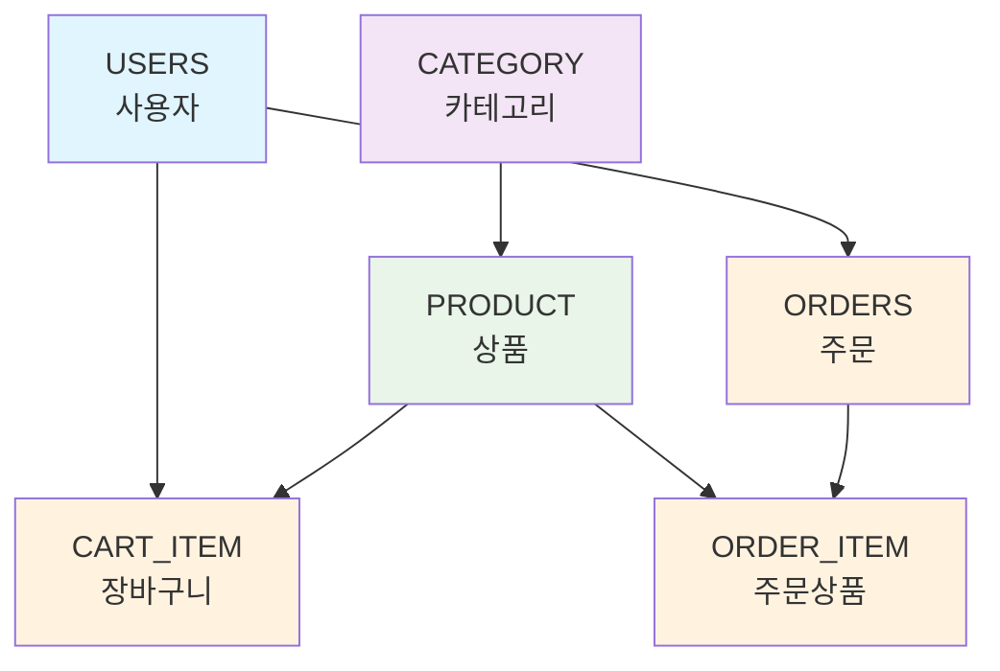

# 🗄️ E-Commerce 쇼핑몰 간단 ERD

## 📊 핵심 테이블 구조

## 🏗️ 테이블별 주요 컬럼

| 테이블 | 주요 컬럼 | 설명 |
|--------|-----------|------|
| **USERS** | `id`, `email`, `password`, `name`, `role` | 사용자 정보 및 권한 |
| **CATEGORY** | `id`, `name`, `description` | 상품 분류 |
| **PRODUCT** | `id`, `name`, `price`, `stock_quantity`, `category_id` | 상품 정보 및 재고 |
| **CART_ITEM** | `id`, `quantity`, `user_id`, `product_id` | 장바구니 상품 |
| **ORDERS** | `id`, `order_number`, `total_amount`, `status`, `user_id` | 주문 정보 |
| **ORDER_ITEM** | `id`, `quantity`, `price`, `order_id`, `product_id` | 주문 상품 상세 |

## 🔗 관계 요약

- **USERS** → **CART_ITEM** (1:N) - 사용자별 장바구니
- **USERS** → **ORDERS** (1:N) - 사용자별 주문
- **CATEGORY** → **PRODUCT** (1:N) - 카테고리별 상품
- **PRODUCT** → **CART_ITEM** (1:N) - 상품별 장바구니
- **PRODUCT** → **ORDER_ITEM** (1:N) - 상품별 주문
- **ORDERS** → **ORDER_ITEM** (1:N) - 주문별 상품 상세

## 💡 핵심 특징

- **Spring Security** 기반 사용자 인증
- **JPA** 엔티티 매핑
- **CASCADE DELETE** 지원
- **자동 타임스탬프** 관리
- **재고 자동 관리** 시스템
