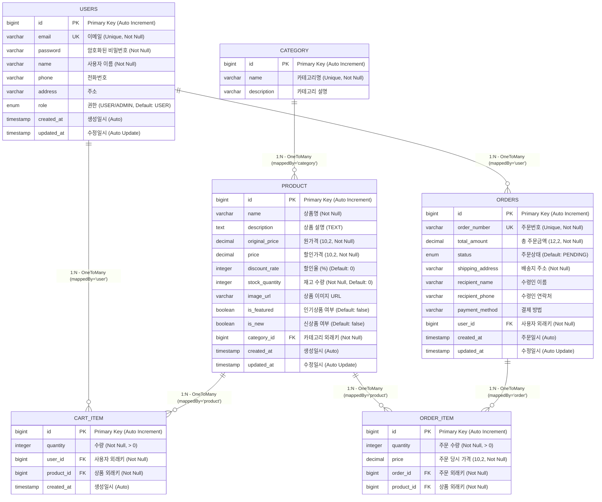
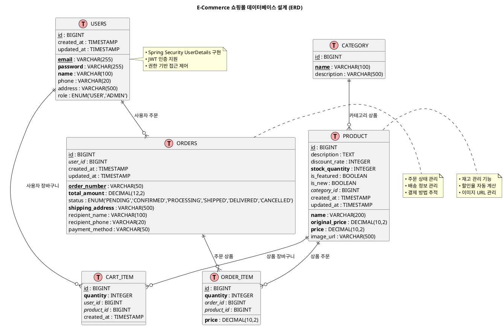

# 🗄️ E-Commerce 쇼핑몰 ERD 다이어그램

## 📊 시각적 ERD 다이어그램

### Mermaid 다이어그램

### PlantUML 다이어그램

## 🔗 테이블 관계 상세

### 1. USERS (사용자)
- **주요 기능**: 사용자 인증, 권한 관리
- **특징**: Spring Security UserDetails 구현
- **관계**: 
  - `1:N` → `CART_ITEM` (장바구니 아이템)
  - `1:N` → `ORDERS` (주문)

### 2. CATEGORY (카테고리)
- **주요 기능**: 상품 분류
- **특징**: 계층적 구조 지원 가능
- **관계**: 
  - `1:N` → `PRODUCT` (상품)

### 3. PRODUCT (상품)
- **주요 기능**: 상품 정보, 재고 관리
- **특징**: 할인율, 인기상품, 신상품 플래그
- **관계**: 
  - `N:1` ← `CATEGORY` (카테고리)
  - `1:N` → `CART_ITEM` (장바구니)
  - `1:N` → `ORDER_ITEM` (주문 상품)

### 4. CART_ITEM (장바구니)
- **주요 기능**: 사용자별 장바구니 관리
- **특징**: 수량 관리, 중복 상품 방지
- **관계**: 
  - `N:1` ← `USERS` (사용자)
  - `N:1` ← `PRODUCT` (상품)

### 5. ORDERS (주문)
- **주요 기능**: 주문 정보, 상태 관리
- **특징**: 주문번호, 배송 정보, 결제 방법
- **관계**: 
  - `N:1` ← `USERS` (사용자)
  - `1:N` → `ORDER_ITEM` (주문 상품)

### 6. ORDER_ITEM (주문 상품)
- **주요 기능**: 주문별 상품 상세 정보
- **특징**: 주문 당시 가격 보존
- **관계**: 
  - `N:1` ← `ORDERS` (주문)
  - `N:1` ← `PRODUCT` (상품)

## 📋 주요 제약사항

### 데이터 무결성
- **외래키 제약**: 모든 관계는 CASCADE DELETE 지원
- **NOT NULL**: 필수 필드 보장
- **UNIQUE**: 이메일, 카테고리명, 주문번호 중복 방지
- **CHECK**: 가격, 수량, 할인율 범위 검증

### 비즈니스 규칙
- **재고 관리**: 주문 시 자동 재고 차감
- **주문 상태**: 상태 변경 순서 제한
- **할인율**: 0~100% 범위 제한
- **가격**: 할인가 ≤ 원가 보장

## 🚀 성능 최적화

### 인덱스 전략
- **Primary Key**: 자동 인덱스
- **Unique Key**: 이메일, 주문번호
- **Composite Index**: 사용자+상품, 카테고리+가격
- **Full-Text Index**: 상품명 검색

### 쿼리 최적화
- **Lazy Loading**: JPA FetchType.LAZY 활용
- **Pagination**: 대용량 데이터 처리
- **Caching**: 자주 조회되는 데이터 캐싱

---

🎯 **이 ERD는 실제 구현된 Java 엔티티와 완벽하게 일치합니다**

🔧 **Spring Boot + JPA + MySQL 환경에서 최적화되어 있습니다**

📊 **Mermaid와 PlantUML 다이어그램을 모두 제공합니다**

