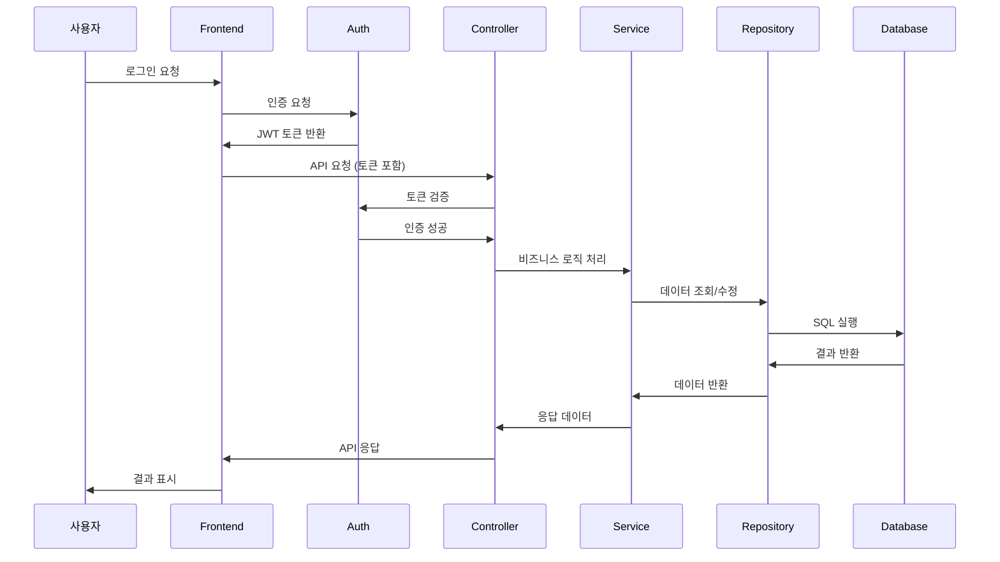
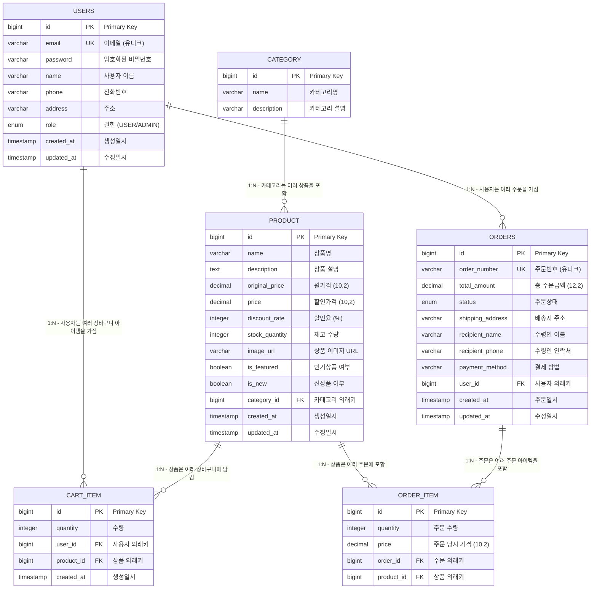

# 🛒 E-Commerce 쇼핑몰 프로젝트

실무에서 사용하는 주요 기능들을 모두 포함한 완전한 이커머스 플랫폼입니다.

## 🚀 기술 스택

| **Frontend** |      |
|------|------|
| **Backend** |    |
| **Server** |  |
| **DB** |   | 
| **Tools** |      |


## 📊 데이터베이스 스키마 (ERD)

추후 추가

## 🌟 주요 기능

### 👤 사용자 기능
- **회원가입/로그인**: JWT 토큰 기반 인증
- **프로필 관리**: 개인정보 수정
- **상품 조회**: 목록, 상세, 검색, 필터링
- **장바구니**: 상품 추가/수정/삭제, 수량 조절
- **주문 관리**: 주문 생성, 조회, 취소
- **주문 내역**: 개인 주문 히스토리

### 👨‍💼 관리자 기능
- **상품 관리**: CRUD, 할인율 설정, 재고 관리
- **카테고리 관리**: 상품 분류 시스템
- **주문 관리**: 전체 주문 조회, 상태 변경
- **파일 업로드**: 상품 이미지 업로드
- **통계 대시보드**: 매출, 주문 현황

### 🛍️ 쇼핑 기능
- **상품 분류**: 인기상품, 신상품 태깅
- **할인 시스템**: 동적 할인율 계산
- **검색 기능**: 실시간 검색 (최소 2글자)
- **필터링**: 카테고리별, 가격별 필터
- **페이징**: 페이지네이션 지원
- **슬라이더**: 홈페이지 상품 슬라이더

## 프로젝트 사용자 화면 및 시연 영상
### 시연 영상

### 사용자 화면
| 메인 화면 | 메인 화면-인기 상품 | 전체 상품 | 전체 상품 |
|--------|--------|--------|--------|
| | |  | |

| 로그인 | 회원가입 | 장바구니-모달 창 |
|--------|--------|--------|
|||

| 장바구니 | 상품결제 | 결제완료 |
|--------|--------|--------|
| | | |

| 결제완료-배송준비 | 사용자 주문 목록 | 관리자페이지-상품관리 |
|--------|--------|--------|
| | | |

| 관리자페이지-상품관리 | 관리자페이지-카테고리관리 | 관리자페이지-주문관리 |
|--------|--------|--------|
| | | |


## 🚀 빠른 시작

### ⚡ 1분 만에 실행하기

```bash
# 1. 프로젝트 클론
git clone <repository-url>
cd etc

# 2. 백엔드 실행 (새 터미널)
mvn spring-boot:run

# 3. 프론트엔드 실행 (새 터미널)
cd frontend
npm install
npm run dev
```

### 🌐 접속 정보
- **프론트엔드**: http://localhost:5173
- **백엔드 API**: http://localhost:8080
- **H2 데이터베이스**: http://localhost:8080/h2-console

### 🔑 테스트 계정
- **관리자**: `admin@shop.com` / `admin123`
- **일반 사용자**: `user@shop.com` / `user123`

---

## 🎯 프로젝트 개요

이 프로젝트는 **Spring Boot 3.2**와 **React 19**를 사용하여 구현한 완전한 이커머스 쇼핑몰 시스템입니다. 

### ✨ 특징
- 🔐 **JWT 기반 인증/인가 시스템**
- 🛒 **실시간 장바구니 관리**
- 📦 **상품 관리 및 할인 시스템**
- 📋 **주문 및 재고 관리**
- 👨‍💼 **관리자 대시보드**
- 📱 **반응형 웹 디자인**
- 🔍 **실시간 검색 및 필터링**

---

## 🏗️ 시스템 아키텍처

### 📊 전체 아키텍처 다이어그램

```mermaid
graph TB
    subgraph "🌐 Frontend (React)"
        A[사용자 인터페이스]
        B[상태 관리]
        C[API 호출]
    end
    
    subgraph "🔒 API Gateway & Security"
        D[JWT 인증]
        E[권한 검증]
        F[CORS 설정]
    end
    
    subgraph "⚙️ Backend (Spring Boot)"
        G[Controller Layer]
        H[Service Layer]
        I[Repository Layer]
    end
    
    subgraph "🗄️ Data Layer"
        J[H2 Database]
        K[File Storage]
    end
    
    A --> C
    C --> D
    D --> E
    E --> F
    F --> G
    G --> H
    H --> I
    I --> J
    H --> K
    
    style A fill:#61DAFB
    style G fill:#6DB33F
    style J fill:#000000
    style K fill:#FF6B6B
```



### 🔄 데이터 흐름



---

## 🛠️ 기술 스택

### Backend
| 기술 | 버전 | 설명 |
|------|------|------|
| **Spring Boot** | 3.2.0 | 웹 애플리케이션 프레임워크 |
| **Spring Security** | 6.2.0 | 인증 및 권한 관리 |
| **Spring Data JPA** | 3.2.0 | 데이터 접근 계층 |
| **Hibernate** | 6.3.1 | ORM 프레임워크 |
| **JWT** | 0.12.3 | 토큰 기반 인증 |
| **H2 Database** | 2.2.224 | 인메모리 데이터베이스 |
| **MySQL** | 8.1.0 | 운영 데이터베이스 |
| **Maven** | 3.9.11 | 빌드 도구 |
| **Java** | 17 | 프로그래밍 언어 |

### Frontend
| 기술 | 버전 | 설명 |
|------|------|------|
| **React** | 19.1.0 | 사용자 인터페이스 라이브러리 |
| **React Router** | 6.30.1 | 클라이언트 사이드 라우팅 |
| **Tailwind CSS** | 4.1.11 | 유틸리티 기반 CSS 프레임워크 |
| **Vite** | 7.0.4 | 빌드 도구 및 개발 서버 |
| **Fetch API** | Native | HTTP 클라이언트 (내장) |

### 개발 도구
| 도구 | 설명 |
|------|------|
| **ESLint** | JavaScript 코드 품질 관리 |
| **PostCSS** | CSS 전처리기 |
| **Autoprefixer** | CSS 벤더 프리픽스 자동 추가 |

---

## 📁 프로젝트 구조

```
etc/
├── 📁 frontend/                    # React 프론트엔드
│   ├── 📁 public/                 # 정적 파일
│   ├── 📁 src/
│   │   ├── 📁 components/         # 재사용 컴포넌트
│   │   │   ├── Header.jsx         # 헤더 컴포넌트
│   │   │   └── Footer.jsx         # 푸터 컴포넌트
│   │   ├── 📁 pages/              # 페이지 컴포넌트
│   │   │   ├── Home.jsx           # 홈페이지
│   │   │   ├── Products.jsx       # 상품 목록
│   │   │   ├── ProductDetail.jsx  # 상품 상세
│   │   │   ├── Cart.jsx           # 장바구니
│   │   │   ├── Login.jsx          # 로그인
│   │   │   ├── Register.jsx       # 회원가입
│   │   │   ├── UserOrders.jsx     # 사용자 주문 내역
│   │   │   └── AdminManagement.jsx # 관리자 페이지
│   │   ├── 📁 services/           # API 서비스
│   │   │   ├── api.js             # API 설정
│   │   │   ├── authService.js     # 인증 서비스
│   │   │   ├── productService.js  # 상품 서비스
│   │   │   ├── cartService.js     # 장바구니 서비스
│   │   │   └── orderService.js    # 주문 서비스
│   │   └── 📁 utils/              # 유틸리티 함수
│   ├── package.json               # 프론트엔드 의존성
│   ├── vite.config.js             # Vite 설정
│   └── tailwind.config.js         # Tailwind CSS 설정
│
├── 📁 src/                        # Spring Boot 백엔드
│   └── 📁 main/
│       ├── 📁 java/com/shop/
│       │   ├── 📁 config/         # 설정 클래스
│       │   │   ├── SecurityConfig.java      # 보안 설정
│       │   │   ├── PasswordConfig.java      # 비밀번호 설정
│       │   │   └── WebConfig.java           # 웹 설정
│       │   ├── 📁 controller/     # REST API 컨트롤러
│       │   │   ├── AuthController.java      # 인증 API
│       │   │   ├── ProductController.java   # 상품 API
│       │   │   ├── CartController.java      # 장바구니 API
│       │   │   ├── OrderController.java     # 주문 API
│       │   │   ├── UserController.java      # 사용자 API
│       │   │   ├── CategoryController.java  # 카테고리 API
│       │   │   └── FileUploadController.java # 파일 업로드 API
│       │   ├── 📁 dto/            # 데이터 전송 객체
│       │   │   ├── AuthRequest.java         # 인증 요청 DTO
│       │   │   ├── ProductDto.java          # 상품 DTO
│       │   │   ├── CartItemDto.java         # 장바구니 DTO
│       │   │   ├── OrderDto.java            # 주문 DTO
│       │   │   └── UserDto.java             # 사용자 DTO
│       │   ├── 📁 entity/         # JPA 엔티티
│       │   │   ├── User.java               # 사용자 엔티티
│       │   │   ├── Product.java            # 상품 엔티티
│       │   │   ├── Category.java           # 카테고리 엔티티
│       │   │   ├── CartItem.java           # 장바구니 아이템 엔티티
│       │   │   ├── Order.java              # 주문 엔티티
│       │   │   └── OrderItem.java          # 주문 아이템 엔티티
│       │   ├── 📁 exception/      # 예외 처리
│       │   │   ├── GlobalExceptionHandler.java # 전역 예외 처리
│       │   │   └── ErrorResponse.java       # 에러 응답 DTO
│       │   ├── 📁 repository/     # 데이터 접근 계층
│       │   │   ├── UserRepository.java      # 사용자 리포지토리
│       │   │   ├── ProductRepository.java   # 상품 리포지토리
│       │   │   ├── CategoryRepository.java  # 카테고리 리포지토리
│       │   │   ├── CartItemRepository.java  # 장바구니 리포지토리
│       │   │   ├── OrderRepository.java     # 주문 리포지토리
│       │   │   └── OrderItemRepository.java # 주문 아이템 리포지토리
│       │   ├── 📁 security/       # 보안 관련
│       │   │   ├── JwtUtil.java            # JWT 유틸리티
│       │   │   └── JwtAuthenticationFilter.java # JWT 인증 필터
│       │   ├── 📁 service/        # 비즈니스 로직
│       │   │   ├── AuthService.java        # 인증 서비스
│       │   │   ├── ProductService.java     # 상품 서비스
│       │   │   ├── CartService.java        # 장바구니 서비스
│       │   │   ├── OrderService.java       # 주문 서비스
│       │   │   ├── UserService.java        # 사용자 서비스
│       │   │   └── CategoryService.java    # 카테고리 서비스
│       │   └── ShoppingMallApplication.java # 메인 애플리케이션
│       └── 📁 resources/          # 리소스 파일
│           ├── application.yml    # 애플리케이션 설정
│           └── data.sql           # 초기 데이터
│
├── 📄 pom.xml                     # Maven 설정
├── 📄 ERD.md                      # 데이터베이스 설계 문서
├── 📄 API_SPECIFICATION.md        # API 명세서
└── 📄 README.md                   # 프로젝트 문서
```

---

## 🚀 설치 및 실행

### 사전 요구사항
- **Java 17** 이상
- **Node.js 18** 이상
- **npm** 또는 **yarn**

### 📥 1. 프로젝트 클론
```bash
git clone <repository-url>
cd etc
```

### ⚙️ 2. 백엔드 실행
```bash
# 프로젝트 루트에서
mvn clean install
mvn spring-boot:run
```

### 🎨 3. 프론트엔드 실행
```bash
cd frontend
npm install
npm run dev
```

### 🌐 4. 접속 정보
- **프론트엔드**: http://localhost:5173
- **백엔드 API**: http://localhost:8080
- **H2 데이터베이스 콘솔**: http://localhost:8080/h2-console
  - JDBC URL: `jdbc:h2:mem:testdb`
  - Username: `sa`
  - Password: (비어있음)

### 🔑 5. 테스트 계정
- **관리자**: `admin@shop.com` / `admin123`
- **일반 사용자**: `user@shop.com` / `user123`


## 🗄️ 데이터베이스 설계

### ERD 다이어그램



### 주요 테이블 설명

| 테이블 | 설명 | 주요 기능 |
|--------|------|---------|
| `users` | 사용자 정보 | 회원가입, 로그인, 프로필 관리 |
| `category` | 상품 카테고리 | 상품 분류 관리 |
| `product` | 상품 정보 | 상품 관리, 할인율 계산 |
| `cart_item` | 장바구니 아이템 | 장바구니 관리 |
| `orders` | 주문 정보 | 주문 생성, 상태 관리 |
| `order_item` | 주문 상품 상세 | 주문한 상품 정보 |

### 데이터 타입 및 제약사항

| 필드 | 타입 | 제약사항 | 설명 |
|------|------|----------|------|
| `id` | `BIGINT` | `PRIMARY KEY, AUTO_INCREMENT` | 고유 식별자 |
| `email` | `VARCHAR(255)` | `UNIQUE, NOT NULL` | 사용자 이메일 |
| `password` | `VARCHAR(255)` | `NOT NULL` | 암호화된 비밀번호 |
| `role` | `ENUM` | `'USER', 'ADMIN'` | 사용자 권한 |
| `status` | `ENUM` | `'PENDING', 'SHIPPING', 'DELIVERED', 'CANCELLED'` | 주문 상태 |
| `price` | `DECIMAL(10,2)` | `NOT NULL, >= 0` | 상품 가격 |

> 📊 **상세 ERD 문서**: [ERD.md](./ERD.md)

---

## 📚 API 명세서

### 🔐 인증 API

#### 회원가입
```http
POST /api/auth/signup
Content-Type: application/json

{
  "email": "user@example.com",
  "password": "password123",
  "name": "홍길동",
  "phone": "010-1234-5678",
  "address": "서울시 강남구"
}
```

#### 로그인
```http
POST /api/auth/login
Content-Type: application/json

{
  "email": "user@example.com",
  "password": "password123"
}
```

**응답 예시:**
```json
{
  "token": "eyJhbGciOiJIUzI1NiIsInR5cCI6IkpXVCJ9...",
  "user": {
    "id": 1,
    "email": "user@example.com",
    "name": "홍길동",
    "role": "USER"
  }
}
```

### 📦 상품 API

#### 상품 목록 조회
```http
GET /api/products?page=0&size=10&category=1&search=노트북&sort=price,asc
Authorization: Bearer {token}
```

**쿼리 파라미터:**
- `page`: 페이지 번호 (0부터 시작)
- `size`: 페이지 크기
- `category`: 카테고리 ID
- `search`: 검색어 (최소 2글자)
- `sort`: 정렬 기준 (price,asc / price,desc / created,desc)

#### 상품 상세 조회
```http
GET /api/products/{id}
Authorization: Bearer {token}
```

### 🛒 장바구니 API

#### 장바구니 조회
```http
GET /api/cart
Authorization: Bearer {token}
```

#### 상품 추가
```http
POST /api/cart
Authorization: Bearer {token}
Content-Type: application/json

{
  "productId": 1,
  "quantity": 2
}
```

### 📋 주문 API

#### 주문 생성
```http
POST /api/orders
Authorization: Bearer {token}
Content-Type: application/json

{
  "items": [
    {
      "productId": 1,
      "quantity": 2
    }
  ],
  "shippingAddress": "서울시 강남구 테헤란로 123",
  "recipientName": "홍길동",
  "recipientPhone": "010-1234-5678",
  "paymentMethod": "virtual"
}
```

#### 주문 목록 조회
```http
GET /api/orders
Authorization: Bearer {token}
```

### 📁 파일 업로드 API

#### 이미지 업로드
```http
POST /api/upload
Authorization: Bearer {token}
Content-Type: multipart/form-data

file: [이미지 파일]
```

> 📖 **상세 API 문서**: [API_SPECIFICATION.md](./API_SPECIFICATION.md)

---

## 🎨 주요 페이지

### 일반 사용자 페이지
- **🏠 홈페이지**: 인기상품/신상품 슬라이더, 카테고리별 상품
- **📦 상품 목록**: 검색, 카테고리 필터링, 페이징, 정렬
- **🔍 상품 상세**: 상품 정보, 장바구니 담기, 수량 선택
- **🛒 장바구니**: 수량 조절, 총액 계산, 상품 제거
- **📋 주문 내역**: 주문 조회, 상태 확인, 주문 취소
- **👤 프로필**: 개인정보 수정, 주소 관리

### 관리자 페이지
- **📊 관리자 대시보드**: 상품/카테고리/주문 관리
- **📦 상품 관리**: 상품 CRUD, 할인율 설정, 재고 관리
- **🏷️ 카테고리 관리**: 카테고리 CRUD
- **📋 주문 관리**: 주문 상태 변경, 전체 주문 조회
- **📁 파일 업로드**: 상품 이미지 업로드

---

## 💡 핵심 기능 설명

### 🔐 인증/보안 시스템
- **JWT 토큰**: 무상태 인증 방식으로 서버 부하 최소화
- **역할 기반 접근 제어**: USER/ADMIN 권한 분리
- **토큰 만료**: 24시간 자동 만료로 보안 강화
- **CORS 설정**: 프론트엔드와의 원활한 통신

### 🛍️ 할인 시스템
- **원가격**: 상품의 정가 (할인 전 가격)
- **할인가격**: 실제 판매 가격
- **할인율**: `((원가격 - 할인가격) / 원가격) * 100` 자동 계산
- **동적 표시**: 할인이 있는 상품만 할인율 뱃지 표시

### 🛒 장바구니 시스템
- **실시간 업데이트**: 수량 변경 시 즉시 반영
- **중복 방지**: 같은 상품 중복 담기 방지
- **재고 검증**: 장바구니 담기 시 재고 확인
- **자동 정리**: 상품 삭제 시 관련 장바구니 아이템 자동 제거

### 📦 주문 시스템
- **주문 상태 관리**: PENDING → SHIPPING → DELIVERED → CANCELLED
- **재고 관리**: 주문 시 자동 차감, 취소 시 자동 복원
- **주문번호 생성**: 자동 주문번호 생성 (ORD-YYYYMMDD-XXX)
- **주문 취소**: PENDING 상태에서만 취소 가능

### 🔍 검색 및 필터링
- **실시간 검색**: 상품명 기반 부분 검색 (최소 2글자)
- **카테고리 필터**: 카테고리별 상품 필터링
- **가격 필터**: 가격대별 상품 필터링
- **정렬 기능**: 가격, 생성일, 인기도별 정렬

---

## 🛠️ 개발 환경

### 개발 도구
- **IDE**: IntelliJ IDEA, VS Code
- **데이터베이스**: H2 (개발), MySQL (운영)
- **API 테스트**: Postman, Insomnia
- **버전 관리**: Git

### 개발 환경 설정
```yaml
# application-dev.yml
spring:
  datasource:
    url: jdbc:h2:mem:testdb
    driver-class-name: org.h2.Driver
  jpa:
    hibernate:
      ddl-auto: create-drop
    show-sql: true
  h2:
    console:
      enabled: true
```

### 운영 환경 설정
```yaml
# application-prod.yml
spring:
  datasource:
    url: jdbc:mysql://localhost:3306/shopping_mall
    username: ${DB_USERNAME}
    password: ${DB_PASSWORD}
  jpa:
    hibernate:
      ddl-auto: validate
    show-sql: false
```

---

## 🚀 배포 가이드

### Docker 배포

#### 1. Dockerfile 생성
```dockerfile
# Backend Dockerfile
FROM openjdk:17-jdk-slim
COPY target/shopping-mall-*.jar app.jar
EXPOSE 8080
ENTRYPOINT ["java", "-jar", "/app.jar"]
```

#### 2. Docker Compose 설정
```yaml
version: '3.8'
services:
  backend:
    build: .
    ports:
      - "8080:8080"
    environment:
      - SPRING_PROFILES_ACTIVE=prod
      - DB_USERNAME=${DB_USERNAME}
      - DB_PASSWORD=${DB_PASSWORD}
    depends_on:
      - mysql
  
  mysql:
    image: mysql:8.0
    environment:
      - MYSQL_ROOT_PASSWORD=${MYSQL_ROOT_PASSWORD}
      - MYSQL_DATABASE=shopping_mall
    ports:
      - "3306:3306"
    volumes:
      - mysql_data:/var/lib/mysql

volumes:
  mysql_data:
```

### 클라우드 배포

#### AWS 배포
1. **EC2 인스턴스 생성**
2. **RDS MySQL 데이터베이스 설정**
3. **S3 버킷 생성** (이미지 저장용)
4. **CloudFront 설정** (CDN)

#### 배포 스크립트
```bash
#!/bin/bash
# deploy.sh

# 백엔드 빌드
mvn clean package -DskipTests

# Docker 이미지 빌드
docker build -t shopping-mall-backend .

# 컨테이너 실행
docker-compose up -d
```

---

## 🤝 기여 가이드

### 기여 방법
1. **Fork** 이 저장소
2. **Feature branch** 생성 (`git checkout -b feature/AmazingFeature`)
3. **Commit** 변경사항 (`git commit -m 'Add some AmazingFeature'`)
4. **Push** 브랜치 (`git push origin feature/AmazingFeature`)
5. **Pull Request** 생성

### 개발 가이드라인
- **코드 스타일**: Java는 Google Java Style Guide 준수
- **커밋 메시지**: Conventional Commits 형식 사용
- **테스트**: 새로운 기능에 대한 테스트 코드 작성
- **문서화**: API 변경 시 문서 업데이트

### 이슈 리포트
버그 리포트나 기능 요청은 [Issues](../../issues) 페이지를 이용해주세요.

---

## 📈 향후 개발 계획

### 🚀 단기 계획 (1-2개월)
- [ ] **파일 업로드 개선**: 다중 이미지 업로드
- [ ] **결제 시스템**: 토스페이먼츠, 아임포트 연동
- [ ] **이메일 알림**: 주문 확인, 배송 알림
- [ ] **리뷰 시스템**: 상품 리뷰 및 평점

### 🎯 중기 계획 (3-6개월)
- [ ] **고급 검색**: Elasticsearch 연동
- [ ] **분석 대시보드**: 매출, 상품 통계
- [ ] **쿠폰 시스템**: 할인 쿠폰 관리
- [ ] **위시리스트**: 찜 기능

### 🌟 장기 계획 (6개월 이상)
- [ ] **모바일 앱**: React Native 앱 개발
- [ ] **AI 추천**: 상품 추천 시스템
- [ ] **실시간 채팅**: 고객 상담 시스템
- [ ] **마이크로서비스**: 서비스 분리

---

## 📞 문의 및 지원

### 연락처
- **이메일**: [your-email@example.com](mailto:your-email@example.com)
- **GitHub Issues**: [Issues](../../issues)
- **Discussions**: [Discussions](../../discussions)

### 커뮤니티
- **기술 문의**: GitHub Issues 활용
- **기능 제안**: Discussions 활용
- **버그 리포트**: 상세한 재현 방법과 함께

---

## 📄 라이선스

이 프로젝트는 **MIT License** 하에 배포됩니다.

---

<div align="center">

⭐ **이 프로젝트가 도움이 되셨다면 Star를 눌러주세요!**

**Made with ❤️ by Shopping Mall Team**

</div> 
